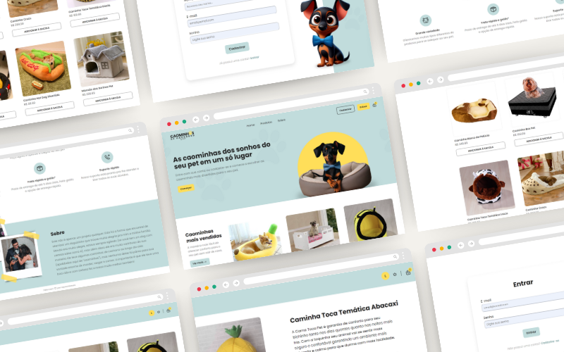

<h1 align="center"> 🐶 Caominhas de Cachorro by Stevão (E-commerce) </h1>

  <a href="#-tecnologias">Tecnologias</a>&nbsp;&nbsp;&nbsp;|&nbsp;&nbsp;&nbsp;
  <a href="#-projeto">Projeto</a>&nbsp;&nbsp;&nbsp;|&nbsp;&nbsp;&nbsp;
  <a href="#-rodar-o-projeto">Projeto</a>

 

  

 

## 💻 Projeto

O projeto é um e-commerce voltado para o mundo pet. Tal projeto foi proposto na aula do curso **Vem Ser Tech - Front-End da Ada Tech em parceria com o iFood**.

 

## 🚀 Tecnologias

Esse projeto foi desenvolvido com as seguintes tecnologias e bibliotecas:

- ReactJS
- react-router-dom
- Axios
- Formik
- json-server
- Styled-components
- Yup
- Node
- Git
    

## ▶ Rodar o projeto

- Primeiro passo, clone o projeto em sua máquina (ou se desejar, crie um fork e após isso clone o projeto)
- Abra a pasta do projeto no terminal
- Instale as dependências com o comando `npm install`
- Inicie o servidor com o comando `npm run dev`, que iniciará o front e `npm run backend` para rodar o json-server.
